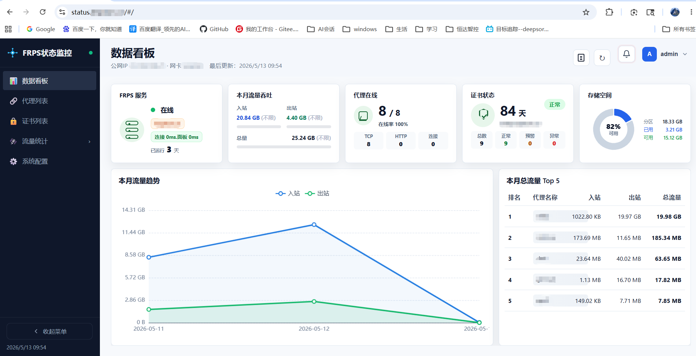

# 内网穿透运维工具



这是一个基于 **frp** 的内网穿透部署与监控工具。您可以用它把家里、公司内网或 NAS 上的服务快速发布到公网，并通过一个 Web 面板持续查看代理状态、流量使用、证书有效期和告警情况。

它适合这些场景：

- 想把 Emby、Alist、Web 管理后台等内网服务通过域名访问；
- 想自动配置 frps、frpc、Nginx 反向代理和 HTTPS 证书；
- 想查看每个代理的在线状态、月度流量、网卡出入站流量；
- 想在流量超限、代理离线或证书即将到期时收到邮件提醒；
- 想减少手动维护 frp、Nginx、证书和监控脚本的工作量。

项目包含两个主要部分：

| 组件                  | 作用                                                         |
| --------------------- | ------------------------------------------------------------ |
| `vps-install-frps.py` | VPS 一键部署脚本，负责生成 frps、frpc、Nginx、Certbot 和状态面板配置 |
| `frps-status-app/`    | Web 监控面板，负责查看代理、流量、证书、事件告警和系统配置   |

---

## 许可证

本项目采用 **Apache License 2.0** 许可证。

详情请查看 [LICENSE](./LICENSE) 文件。

---

## 一、开始之前

在部署前，你需要准备好：

1. **一台 VPS**  
   建议使用 Ubuntu / Debian / CentOS 等常见 Linux 系统，并已安装 Docker Engine 和 Docker Compose 插件。

2. **一个域名**  
   域名需要提前解析到 VPS 公网 IPv4 地址。

3. **通配符解析**  
   建议添加：

   ```text
   *.<你的根域名>  A 记录  <VPS 公网 IP>
   ```

   例如你的域名是 `example.com`，则需要把：

   ```text
   *.example.com
   ```

   解析到 VPS 公网 IP。

4. **开放端口**  
   VPS 安全组或防火墙至少需要开放：

   - `80/tcp`：申请 HTTPS 证书使用；
   - `443/tcp`：HTTPS 访问入口；
   - frps 服务端口：脚本会自动生成或使用你配置的端口；
   - 你需要直接暴露的 TCP 代理端口。

---

## 二、最快部署流程

### 第 1 步：生成配置文件

在项目根目录执行：

```bash
python3 vps-install-frps.py
```

如果当前目录不存在 `frps-config.json`，脚本会自动生成一份默认配置文件并退出。

### 第 2 步：编辑 `frps-config.json`

最少需要填写这些内容：

```jsonc
{
  "root_domain": "example.com",
  "cert_email": "your-email@example.com",
  "services": [
    {
      "alias": "emby",
      "comment": "Emby 媒体服务",
      "mode": "http",
      "tunnel": true,
      "port": 8096,
      "local_ip": "127.0.0.1"
    }
  ]
}
```

其中：

- `root_domain`：你的根域名，例如 `example.com`；
- `vps_public_ip`：VPS 公网 IP，不填时脚本会尝试自动获取；
- `cert_email`：申请 HTTPS 证书时使用的邮箱；
- `services`：你想穿透或反代的服务列表。

### 第 3 步：部署服务端

确认配置无误后执行：

```bash
python3 vps-install-frps.py -r
```

脚本会自动完成：

- 生成 frps 配置；
- 生成 frpc 客户端配置；
- 生成 Nginx HTTPS 反向代理配置；
- 申请 HTTPS 证书；
- 启动 frps、Nginx、Certbot 和监控面板容器。

部署完成后，脚本会输出访问地址和需要开放的端口。

### 第 4 步：启动内网客户端

服务端部署完成后，项目目录下会生成：

```text
frpc/
  docker-compose.yml
  frpc.toml
```

把整个 `frpc/` 目录复制到内网机器，例如 NAS、家用服务器或公司内网主机，然后执行：

```bash
cd frpc
docker compose up -d
```

启动成功后，就可以通过域名访问你的内网服务。

---

## 三、如何访问服务

### 3.1 HTTP / Web 服务

如果服务配置为：

```jsonc
{
  "alias": "emby",
  "mode": "http"
}
```

访问地址就是：

```text
https://emby.<你的根域名>
```

例如：

```text
https://emby.example.com
```

HTTP 模式默认通过 Nginx 提供 HTTPS 入口，更适合 Web 服务、管理后台、媒体服务等场景。

### 3.2 TCP 服务

如果服务配置为：

```jsonc
{
  "alias": "ssh-home",
  "mode": "tcp",
  "port": 5022
}
```

访问地址就是：

```text
<VPS 公网 IP>:5022
```

TCP 模式适合 SSH、数据库、私有协议等非 Web 服务。

### 3.3 状态面板

默认启用状态面板时，访问地址为：

```text
https://status.<你的根域名>
```

默认登录账号：

```text
用户名：admin
密码：admin123
```

正式使用时，建议修改默认账号和密码。

### 3.4 frps Dashboard

frps Dashboard 默认提供 HTTPS 反代入口：

```text
https://frps.<你的根域名>
```

---

## 四、服务配置说明

`services` 用来描述你要发布的服务。每个服务可以是 HTTP 模式，也可以是 TCP 模式。

### 4.1 常用字段

| 字段               | 是否必填 | 说明                                                         |
| ------------------ | -------- | ------------------------------------------------------------ |
| `alias`            | 是       | 服务别名，也是子域名前缀，例如 `emby` 对应 `https://emby.example.com` |
| `comment`          | 否       | 服务备注，用于配置说明和列表展示                             |
| `mode`             | 否       | 服务模式，`http` 或 `tcp`，默认 `http`                       |
| `tunnel`           | 否       | 是否通过 frp 穿透，默认 `true`                               |
| `port`             | 是       | frps 侧端口，也就是公网 TCP 端口或 frpc 的 `remotePort`      |
| `local_port`       | 否       | 内网真实服务端口，不填时等于 `port`                          |
| `local_ip`         | 否       | 内网真实服务 IP，默认 `127.0.0.1`                            |
| `expose_http_port` | 否       | HTTP 模式下是否额外开放 `VPS_IP:port` 直连入口，默认 `false` |

### 4.2 穿透内网 Web 服务

例如内网机器上有一个 Emby 服务，端口是 `8096`：

```jsonc
{
  "alias": "emby",
  "comment": "Emby 媒体服务",
  "mode": "http",
  "tunnel": true,
  "port": 8096,
  "local_port": 8096,
  "local_ip": "127.0.0.1"
}
```

访问地址：

```text
https://emby.<你的根域名>
```

### 4.3 反代 VPS 本机服务

如果服务已经运行在 VPS 本机，不需要 frp 穿透，可以设置：

```jsonc
{
  "alias": "alist",
  "comment": "VPS 本机 Alist",
  "mode": "http",
  "tunnel": false,
  "port": 5244,
  "local_port": 5244,
  "local_ip": "127.0.0.1"
}
```

这种模式下不会生成 frpc 代理，只会生成 Nginx HTTPS 反向代理。

### 4.4 暴露 TCP 服务

例如把内网 SSH 服务映射到 VPS 的 `5022` 端口：

```jsonc
{
  "alias": "ssh-home",
  "comment": "家中服务器 SSH",
  "mode": "tcp",
  "tunnel": true,
  "port": 5022,
  "local_port": 22,
  "local_ip": "127.0.0.1"
}
```

访问方式：

```bash
ssh -p 5022 user@<VPS 公网 IP>
```

---

## 五、部署脚本常用命令

| 命令                                                         | 作用                                                        |
| ------------------------------------------------------------ | ----------------------------------------------------------- |
| `python3 vps-install-frps.py`                                | 生成默认配置文件或根据配置生成部署文件，不启动容器          |
| `python3 vps-install-frps.py -r`                             | 生成配置、申请证书并启动所有容器                            |
| `python3 vps-install-frps.py -p`                             | 只更新代理相关配置，不自动申请证书，所有服务按 TCP 代理处理 |
| `python3 vps-install-frps.py -s`                             | 停止已启动的 Docker Compose 服务，不删除文件和镜像          |
| `python3 vps-install-frps.py --clean`                        | 清理脚本生成的容器、镜像和目录                              |
| `python3 vps-install-frps.py -c /path/to/frps-config.json -r` | 使用指定配置文件部署                                        |

再次执行 `-r` 时，脚本会读取上次部署记录，并尽量保留已有配置：

- 配置未变化的服务不会重新生成随机端口、token 或容器后缀；
- 新增服务会自动加入 frps、frpc、Nginx 和证书配置；
- 删除服务会从 frps、frpc 和 Nginx 配置中移除；
- 修改过端口、模式、穿透方式的服务会按新配置更新。

已存在的证书不会重复申请，后续续期由 Certbot 容器处理。

---

## 六、状态面板能看什么

状态面板主要用于日常运维，不需要频繁登录服务器查看日志。

| 页面     | 你可以做什么                                                 |
| -------- | ------------------------------------------------------------ |
| 数据看板 | 查看 frps 在线状态、本月流量、网卡流量、证书预警、代理数量和趋势图 |
| 代理列表 | 查看每个代理是否在线、连接数、月度流量和关联证书             |
| 证书列表 | 查看证书有效期、剩余天数、TLS 握手状态和异常信息             |
| 历史统计 | 查看每日流量明细、Top 5 服务、趋势折线图，并支持导出 CSV     |
| 流量统计 | 按公网 IP / 网卡维度查看每日入站、出站和总量趋势             |
| 系统配置 | 配置 SMTP 邮件、流量阈值、事件告警和数据库维护策略           |

### 6.1 流量与告警配置

你可以在系统配置中设置：

- 月入站流量阈值；
- 月出站流量阈值；
- 总流量阈值；
- 网卡总量阈值；
- 月入站流量限额；
- 月出站流量限额；
- 总流量限额；
- 网卡总量限额；
- 代理离线告警；
- SSL 证书到期告警；
- 流量超限告警；
- 邮件通知联动。

阈值主要用于提前提醒，限额主要用于判断是否已经达到你设定的使用边界。

### 6.2 SMTP 邮件通知

配置 SMTP 后，系统可以在代理离线、证书即将到期或流量达到阈值时发送邮件提醒。

如果 SMTP 未配置，系统仍会在面板内保留告警提示，但不会发送邮件。

### 6.3 历史数据保留天数

系统配置中可以设置历史数据保留天数，例如：

```text
保留近 60 天历史记录
```

超过保留天数的数据由后端自动清理，用户无需手动点击清理按钮。

数据库维护中仍可以执行 `VACUUM`，用于整理 SQLite 数据库文件空间、减少碎片。

---

## 七、状态面板环境变量

通常情况下，使用 `vps-install-frps.py -r` 部署时，脚本会自动写入状态面板所需的 `.env` 配置。

只有在你需要单独部署或调试状态面板时，才需要手动编辑：

```bash
cd frps-status-app
cp .env.example .env
```

常用变量如下：

| 变量                      | 默认值                           | 说明                                                  |
| ------------------------- | -------------------------------- | ----------------------------------------------------- |
| `LISTEN`                  | `0.0.0.0:8080`                   | 容器内监听地址                                        |
| `STATUS_APP_BIND`         | `127.0.0.1`                      | 映射到宿主机的绑定地址，设为 `0.0.0.0` 才允许公网直通 |
| `STATUS_APP_PORT`         | `28080`                          | 映射到宿主机的 HTTP 端口                              |
| `DB_PATH`                 | `/data/frps-status.sqlite`       | SQLite 数据库路径                                     |
| `FRPS_HOST`               | `frps`                           | frps 所在主机                                         |
| `FRPS_BIND_PORT`          | `7000`                           | frps 服务端口                                         |
| `FRPS_DASHBOARD_PORT`     | `7500`                           | frps Dashboard 端口                                   |
| `FRPS_DASHBOARD_USER`     | —                                | Dashboard 用户名                                      |
| `FRPS_DASHBOARD_PASSWORD` | —                                | Dashboard 密码                                        |
| `STATUS_DOMAINS`          | —                                | 逗号分隔的域名，用于证书检测                          |
| `STATUS_USER`             | —                                | 面板登录用户名，留空则不鉴权                          |
| `STATUS_PASSWORD`         | —                                | 面板登录密码                                          |
| `CERT_DIR`                | `/etc/letsencrypt/live`          | 证书目录                                              |
| `POLL_SECONDS`            | `60`                             | 数据轮询间隔，单位秒                                  |
| `HOST_PUBLIC_IP`          | —                                | 宿主机公网 IPv4，部署脚本会自动写入                   |
| `HOST_IFACE`              | —                                | 公网 IP 对应网卡名，部署脚本会自动写入                |
| `HOST_NET_STATS_DIR`      | `/host-net-stats`                | 容器内网卡统计目录                                    |
| `HOST_NET_STATS_MOUNT`    | `/sys/class/net/eth0/statistics` | 宿主机网卡统计挂载路径，手动部署时需按实际网卡调整    |

---

## 八、单独部署状态面板

一般不需要单独部署状态面板，因为一键脚本会自动处理。

如果你只想单独运行状态面板，可以执行：

```bash
cd frps-status-app
cp .env.example .env
# 按实际情况编辑 .env
docker compose up -d --build
```

注意：状态面板默认需要访问 frps Dashboard API。如果单独部署，请确保网络、账号、密码和端口配置正确。

---

## 九、本地开发

如果你只是使用本工具，可以跳过本节。

### 9.1 后端开发

```bash
cd frps-status-app
go run main.go
```

### 9.2 前端开发

```bash
cd frps-status-app/frontend
npm install
npm run dev
```

前端开发服务会把 `/api` 代理到后端地址。

### 9.3 构建前端资源

```bash
cd frps-status-app/frontend
npm run build
```

构建产物会输出到：

```text
frps-status-app/web/
```

---

## 十、开发者参考

### 10.1 API 接口

| 方法       | 路径                       | 说明                                  |
| ---------- | -------------------------- | ------------------------------------- |
| POST       | `/api/login`               | 面板登录                              |
| POST       | `/api/logout`              | 退出登录                              |
| GET        | `/api/session`             | 会话状态                              |
| GET        | `/api/status`              | 完整快照，包括 frps、代理、证书、流量 |
| GET        | `/api/proxies`             | 代理分页列表                          |
| GET        | `/api/certificates`        | 证书分页列表                          |
| GET        | `/api/daily`               | 每日流量明细                          |
| GET        | `/api/daily/interface`     | 网卡 / 公网 IP 维度日流量             |
| GET        | `/api/daily/export`        | 导出 CSV                              |
| GET / POST | `/api/settings`            | 读取 / 保存配置                       |
| POST       | `/api/settings/test-email` | 发送测试邮件                          |
| POST       | `/api/db/vacuum`           | 执行 SQLite VACUUM                    |
| POST       | `/api/db/purge`            | 清理旧数据                            |

除 `/api/login`、`/api/session`、`/api/user/forgot-password` 外，其余接口需要登录态。

### 10.2 目录结构

```text
frp-automic/
├── frps-config.json          # 部署配置，包含密钥，已加入 .gitignore
├── vps-install-frps.py       # 一键部署脚本
├── frps-status-app/
│   ├── main.go               # 程序入口
│   ├── Dockerfile            # 多阶段构建
│   ├── docker-compose.yml
│   ├── .env.example
│   ├── frontend/             # Vue 3 + Vite 前端源码
│   │   └── src/
│   │       ├── views/        # 页面
│   │       ├── api/          # API 封装
│   │       └── utils/        # 格式化工具
│   ├── src/                  # Go 后端源码
│   │   ├── config/           # 配置加载
│   │   ├── model/            # 数据模型
│   │   ├── store/            # SQLite 操作
│   │   ├── frps/             # FRPS API 对接
│   │   ├── mail/             # SMTP 发送
│   │   └── server/           # HTTP 路由与处理器
│   └── web/                  # 前端构建产物
├── frps/                     # 由部署脚本生成
└── frpc/                     # 由部署脚本生成，复制到内网机器使用
```

---

## 十一、依赖环境

### 普通部署需要

- Docker Engine；
- Docker Compose 插件；
- Python 3；
- 一个已解析到 VPS 的域名。

### 本地开发需要

- Go 1.22+；
- Node.js 20+。

---

## 十二、常见问题

### 1. 域名已经解析了，为什么 HTTPS 证书申请失败？

请检查：

- `80/tcp` 是否已在 VPS 安全组放行；
- 域名 A 记录是否已经生效；
- `root_domain` 是否填写正确；
- 是否配置了 `*.<root_domain>` 通配符解析；
- VPS 上是否已有其他程序占用了 80 端口。

### 2. frpc 启动了，但服务访问不了？

请检查：

- 内网真实服务是否正常运行；
- `local_ip` 和 `local_port` 是否正确；
- frpc 所在机器能否访问本机或内网目标服务；
- VPS 安全组是否放行了对应 TCP 端口；
- frps 服务端口是否与 frpc 配置一致。

### 3. HTTP 服务是否必须开放 `VPS_IP:port`？

不是。HTTP 服务默认通过：

```text
https://<alias>.<root_domain>
```

访问即可。

只有在调试或特殊场景下，才建议设置：

```jsonc
"expose_http_port": true
```

### 4. 状态面板是否必须公网直通？

不建议公网直通。默认配置会让状态面板通过 Nginx HTTPS 反代访问，也就是：

```text
https://status.<root_domain>
```

如果把 `STATUS_APP_BIND` 或 `status.http` 设置为公网监听，请务必配置强密码，并限制访问来源。

### 5. 删除服务后证书目录会自动删除吗？

不会。删除服务后，脚本会移除 frps、frpc 和 Nginx 入口配置，但不会自动删除已有证书目录，避免误删仍在使用的证书。